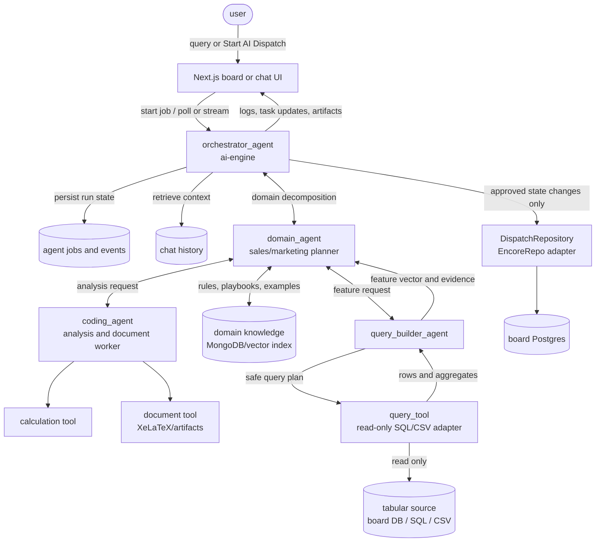

# Multiagent Workflow Design

Last updated: 2026-06-27

This document proposes the future multiagent design for the current Encore.ts
hackathon app in `budde/`. It is based on:

- `AI-DISPATCHER-HACKATHON-PLAN.md`
- `HACKATHON-MILESTONE.md`
- `docs/devlogs/2026-06-27-schema-contract-vs-fe.md`
- `docs/devlogs/2026-06-27-latex-generate-document-wip.md`
- the current agentic design sketch: orchestrator, domain agent, coding agent,
  query builder, calculation tool, domain knowledge, and tabular data source.

## Current Baseline

The app is no longer only a plan. The current runtime path is:

1. Frontend board calls `startDispatch()` in `budde/frontend/app/lib/board.ts`.
2. `POST /dispatch/start` in `budde/ai-engine/dispatch-api.ts` creates an
   in-memory job and starts `runDispatch(encoreRepo, onLog)` in the background.
3. Frontend polls `GET /dispatch/status/:jobId` for logs and reloads `/tasks`
   while the dispatch job is running.
4. `runDispatch()` in `budde/ai-engine/dispatch/run.ts` uses Track B:
   `@anthropic-ai/claude-agent-sdk`, local `claude` CLI login, MCP tools, and
   no `ANTHROPIC_API_KEY`.
5. MCP tools in `budde/ai-engine/dispatch/tools.ts` call only the
   `DispatchRepository` interface from `budde/shared/contract.ts`.
6. `encoreRepo` currently implements that interface by reading/writing the
   `board` database directly because board endpoints are auth-protected and the
   backend dispatch worker has no frontend user token.
7. LaTeX document generation is wired as `generate_document`, using XeLaTeX via
   `budde/ai-engine/latex/compile.ts`, but the end-to-end flow still needs final
   verification.

The most important existing decision is still valid:

> Agents do not chase frontend or database schema. Schema drift is absorbed in
> adapters such as `EncoreRepo`. The stable orchestration boundary is
> `DispatchRepository` plus typed events.

## Design Goals

- Keep the board workflow working: task assignment, AI self-claim, artifacts,
  and status polling must continue to work while the system evolves.
- Add future multiagent capability without rewriting the board or frontend
  contracts.
- Separate business reasoning from data access, calculation, document
  generation, and state mutation.
- Keep all writes behind explicit, idempotent tools with atomic database
  behavior.
- Support future user queries over chat history, domain knowledge, SQL, CSV,
  and generated feature vectors.
- Make the runtime observable through job logs now and `DispatchEvent` streaming
  later.

## Target Topology

The future system should treat the current dispatch loop as one workflow hosted
by a higher-level orchestrator.



## Agent Responsibilities

### `orchestrator_agent`

The orchestrator owns the run lifecycle. It should live in `ai-engine`, because
that service already owns dispatch jobs, agent execution, and artifacts.

Responsibilities:

- Accept user intent from the board or future chat UI.
- Create an agent job and persist logs/events.
- Load relevant chat history and board/task context.
- Route work to specialist agents.
- Decide when a plan is ready to execute.
- Call state-mutating tools through stable adapters only.
- Emit `DispatchEvent`-compatible progress for the frontend.
- Enforce max turns, timeouts, cancellation, and retry limits.

The orchestrator should not embed sale/marketing matching rules, SQL-generation
rules, or LaTeX repair logic directly. Those belong in specialist agents and
tools.

### `domain_agent`

The domain agent is the business planner. For the current app, its first domain
is sale/marketing Kanban work.

Responsibilities:

- Decompose a user query or board dispatch run into domain-level work items.
- Classify each task as human assignment, AI self-serve, data question,
  calculation, or document generation.
- Match tasks to member title/skills/current load.
- Decide when a task needs external data from tabular sources.
- Use `domain_knowledge` for sales playbooks, marketing rules, campaign
  examples, brand guidelines, and prior decisions.
- Return structured plans, not direct database writes.

Example output shape:

```ts
export interface DomainPlan {
  intent: "dispatch" | "answer_question" | "generate_report" | "analyze_data";
  summary: string;
  requiredData: Array<{
    source: "board" | "sql" | "csv" | "domain_knowledge";
    reason: string;
  }>;
  taskActions: ProposedTaskAction[];
  analysisRequests: AnalysisRequest[];
}

export type ProposedTaskAction =
  | { kind: "assign"; taskId: number; memberId: string; reason: string }
  | { kind: "claim_ai"; taskId: number; reason: string }
  | { kind: "attach_artifact"; taskId: number; url: string; status: TaskStatus };
```

### `query_builder_agent`

The query builder turns domain questions into safe data-access plans. It should
not mutate production data.

Responsibilities:

- Translate a domain request into a read-only query plan.
- Use a schema registry for SQL tables and CSV columns.
- Produce compact evidence: row samples, aggregates, and provenance.
- Return a feature vector that the domain agent or coding agent can use.
- Refuse or ask for a narrower plan when the requested data source is unknown.

The query builder is the right home for future workflows such as:

- "Which campaign tasks are delayed?"
- "Summarize lead conversion by channel from this CSV."
- "Use board history and sales data to prioritize next week's tasks."

### `coding_agent`

The coding agent is not a repo-editing agent in the production workflow. It is a
sandboxed worker for computation and structured output.

Responsibilities:

- Run deterministic calculations through `calculation_tool`.
- Build chart-ready datasets, KPIs, tables, and feature transforms.
- Generate LaTeX body content for reports and slides.
- Repair LaTeX body content after compiler feedback.
- Return artifacts and summaries to the orchestrator.

The coding agent must not call database writes directly. It should use
calculation and document tools, then let the orchestrator attach final artifacts
through `DispatchRepository`.

## Tools And Boundaries

### Existing Tool Boundary

Keep `budde/shared/contract.ts` as the source of truth for board state mutation:

- `getTodoTasks()`
- `getMembers()`
- `assignTask(taskId, assigneeId)`
- `claimTask(taskId)`
- `attachArtifact(taskId, url, status?)`

The current MCP tools can stay as the first implementation of this boundary.
Future specialist agents should call the same tools or equivalent typed service
functions. Do not let agents write raw board SQL except inside the trusted
adapter.

### New Tool Boundary

Add narrow tools instead of giving agents broad process or database access:

```ts
export interface QueryTool {
  describeSources(): Promise<DataSourceSchema[]>;
  runReadOnly(plan: QueryPlan): Promise<QueryResult>;
}

export interface CalculationTool {
  run(request: CalculationRequest): Promise<CalculationResult>;
}

export interface DomainKnowledgeStore {
  search(query: string, filters?: Record<string, string>): Promise<KnowledgeHit[]>;
  upsert(hit: KnowledgeDocument): Promise<void>;
}

export interface DocumentTool {
  compileLatex(input: {
    kind: "slide" | "report";
    title: string;
    subtitle?: string;
    body: string;
  }): Promise<{ url: string; logTail?: string }>;
}
```

Guardrails:

- `QueryTool` is read-only.
- `CalculationTool` runs in a bounded sandbox with time and output limits.
- `DocumentTool` owns templates and compiler execution; agents only provide the
  body content.
- `DomainKnowledgeStore` is not a replacement for tabular truth. It provides
  playbooks, definitions, examples, and prior decisions.

## Workflow 1: Current Dispatch, Adapted

The current dispatch workflow should be upgraded in place:

1. User clicks "Start AI Dispatch".
2. Frontend calls existing `POST /dispatch/start`.
3. `orchestrator_agent` creates an `agent_run`.
4. Orchestrator asks `domain_agent` for a dispatch plan.
5. Domain agent reads tasks and members through the repository tools.
6. Domain agent classifies each task:
   - human task: propose `assign_task`
   - AI document task: propose `claim_task` plus document generation
   - data-backed task: ask `query_builder_agent` for evidence first
7. Orchestrator executes approved writes through `DispatchRepository`.
8. For report/slide tasks, coding agent generates the LaTeX body, document tool
   compiles the PDF, and orchestrator calls `attachArtifact`.
9. Frontend receives logs through current polling and reloads tasks from `/tasks`.
10. Future upgrade: replace polling logs with `api.streamOut` or keep both.

This keeps the current FE API stable while allowing the internals to become
multiagent.

## Workflow 2: Future Data Question

For future user questions, the same system can answer without forcing everything
through Kanban dispatch.

1. User asks a question in a board/chat UI.
2. Orchestrator loads chat history and recent board context.
3. Domain agent decomposes the question.
4. If the answer needs data, domain agent asks query builder for a read-only
   query plan.
5. Query tool reads SQL/CSV sources and returns evidence.
6. Coding agent computes derived metrics if needed.
7. Orchestrator returns an answer with evidence and optionally creates or updates
   board tasks through the existing repository.

This is where the user's original graph becomes useful: domain decomposition,
query building, tabular feature extraction, and calculation are separate steps
instead of one monolithic prompt.

## Workflow 3: Future Self-Serve Report Or Slide

The LaTeX WIP should become a first-class document workflow:

1. Domain agent classifies a task as in-scope for AI document generation.
2. Orchestrator calls `claimTask(taskId)` atomically.
3. Query builder gathers metrics if the document needs tabular evidence.
4. Coding agent writes only the LaTeX body.
5. Document tool merges the body with a trusted template and runs XeLaTeX.
6. If compile fails, coding agent gets the log tail and repairs the body.
7. Orchestrator attaches the PDF URL and moves the task to `review`.

Keep the two-phase LaTeX rule:

- templates own preamble, fonts, theme, and placeholders.
- agents write only frames, sections, tables, and prose body.

## API Evolution

Do not remove the current API while the frontend depends on it:

- Keep `POST /dispatch/start`.
- Keep `GET /dispatch/status/:jobId`.
- Keep frontend task refresh from `/tasks`.

Add a generic agent API beside it when the second workflow appears:

```ts
export interface StartAgentRequest {
  mode: "dispatch" | "answer_question" | "generate_report" | "analyze_data";
  query?: string;
  taskId?: number;
  sourceIds?: string[];
}

export interface StartAgentResponse {
  jobId: string;
  status: "running" | "done" | "error";
}
```

Recommended endpoints:

- `POST /agent/start`
- `GET /agent/status/:jobId`
- future `api.streamOut` endpoint: `/agent/stream`

`/dispatch/start` can later become a thin wrapper around
`/agent/start { mode: "dispatch" }`.

## Persistence Plan

Current job storage is in memory and acceptable for `encore run`. Future work
should move job state into durable storage:

- `agent_runs`: job id, mode, user id, status, timestamps, summary, error.
- `agent_events`: ordered logs, tool calls, task updates, artifact events.
- `agent_messages`: compact chat history for user-facing conversations.
- `domain_knowledge`: MongoDB or vector-backed store for playbooks and examples.
- `data_source_registry`: schema metadata for SQL and CSV sources.

This lets polling, stream replay, debugging, and post-demo review share the same
event history.

## Implementation Phases

### Phase 1: Stabilize Current Dispatch

- Keep `DispatchRepository` unchanged.
- Verify `encoreRepo` direct-DB behavior after auth changes.
- Verify `generate_document` end-to-end: claim, compile PDF, attach artifact,
  card moves to `review`, artifact URL downloads.
- Keep `FakeRepo`, `seed.json`, and expected checks as regression fixtures.

### Phase 2: Extract Orchestrator Shell

- Move job creation, run status, logging, and cancellation into an
  `orchestrator` module.
- Make current `runDispatch()` a specialist workflow invoked by orchestrator.
- Emit typed events internally even if FE still polls logs.

### Phase 3: Add `domain_agent`

- Start with the current dispatch prompt as the first domain policy.
- Return structured `DomainPlan` JSON.
- Keep the current MCP tools as execution tools.
- Add tests against `FakeRepo` so prompt changes do not silently break dispatch.

### Phase 4: Add Query Builder And Read-Only Query Tool

- Register board DB and demo CSV schemas.
- Add read-only query planning.
- Return evidence rows and feature vectors to the domain agent.
- Keep all writes out of the query tool.

### Phase 5: Move Document Generation Behind `coding_agent`

- Keep `compileLatex()` as the document tool.
- Let coding agent own LaTeX body generation and repair.
- Add template selection later; file templates are enough until FE needs template
  editing.

### Phase 6: Realtime Events

- Keep polling as fallback.
- Add `streamOut` once the event model is stable.
- Send `log`, `task_update`, `artifact`, `done`, and `error` events.
- FE can optimistically move cards from events, then refetch `/tasks` at the end.

## Safety Rules

- State mutation only happens through `DispatchRepository` or future typed write
  tools.
- Task assignment and AI claim remain atomic:
  `UPDATE ... WHERE id = ? AND status = 'todo'`.
- Query tools are read-only.
- Agents receive limited schema and source metadata, not unrestricted database
  access.
- LaTeX compilation stays behind `DocumentTool`; agents do not control preamble
  or compiler flags.
- Every agent run has max turns, timeout, and error reporting.
- Every state-changing action should leave an event for audit and UI replay.
- Schema mismatch is fixed in adapters, not prompts.

## Open Decisions

- Keep polling as the main UX, or reintroduce `streamOut` for realtime logs and
  card updates?
- Store future agent jobs in the board database, a new `ai-engine` database, or
  a separate event store?
- Use MongoDB for domain knowledge immediately, or start with file/JSON fixtures
  and add MongoDB when retrieval quality matters?
- Should document templates stay as files, or move to a DB-backed template editor?
- What is the first tabular source beyond the board DB: uploaded CSV, CRM export,
  or campaign analytics SQL?
